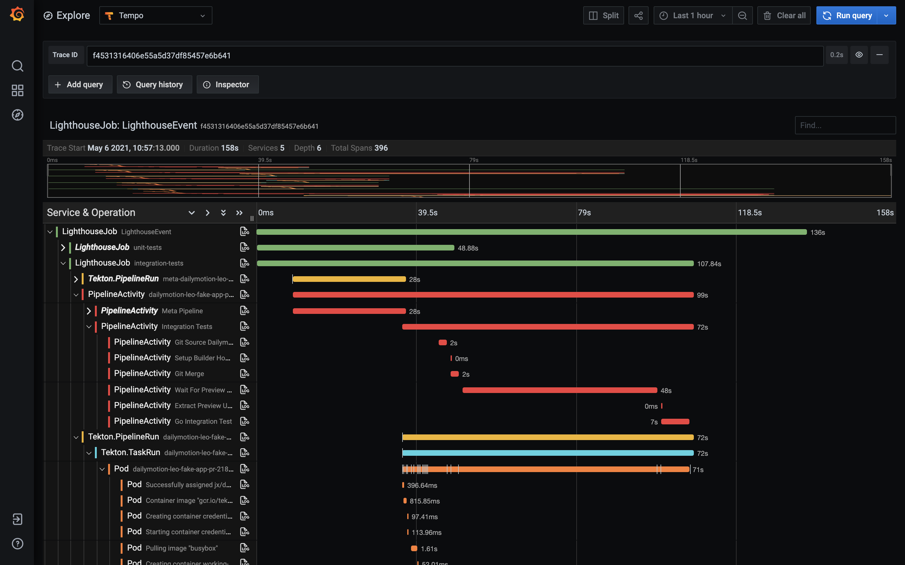

# Lighthouse Telemetry Plugin

This is a [Lighthouse](https://github.com/jenkins-x/lighthouse) (external) plugin, used to generate telemetry data, such as distributed traces.

Here is an example of such a distributed trace, including:
- the Lighthouse event: usually a GitHub (or gitlab/etc) webhook event for a git push or a pull request comment, at the origin of a new pipeline execution
- 1 or more LighthouseJob: 1 for each triggered pipeline. In this case we can see a unit-tests pipeline and an integration-tests pipeline
- for each Lighthouse job: the corresponding Tekton PipelineRun and its TaskRuns
- for each TaskRun: the corresponding Pod, with every event: scheduling, pulling/creating/staring containers, etc
- and the Jenkins X Pipeline Activity, with the timing for each step

## Why?

Get insights into what is happening inside Jenkins X in reaction to a git event. Most of the time you won't need it, except when you need it ;-) for example to understand the bottleneck in your pipelines, what is taking time - maybe you're always pulling big images for example.

## How?

This application should be registered in your Lighthouse config as an external plugin, so that it can receive http requests for each git webhook event.

Then, for each received event, it will start a new opentelemetry trace.

In the background, it will also use the Kubernetes API to watch for:
- lighthouse jobs
- tekton pipelineruns and TaskRuns
- jenkins x pipeline Activities
- pods
- events

when it will see a new lighthouse job, it will uses the event GUID (stored in an annotation) to retrieve internally the opentelemetry trace (the root span). It will use it to start a new child span for the job, and it will store the span context in an annotation of the job.

when it will see a new tekton pipelinerun, it will retrieve its "parent" lighthouse job (using matching labels), and then extract the parent span context from the annotation of the job - and use it to start a new child span for the pipelinerun.

and so on for the taskrun, and then its child pod. The "trick" here is to propagate the span context in an annotation of the resources - the same way you will do with an HTTP header in a "classic" microservices architecture based on synchronous requests.

and then when each resource (job, pipelinerun, pod, ...) will finish, its associated span will be ended - and pushed by the exporter to whatever backend has been configured (grafana tempo by default in Jenkins X).

TODO: make a diagram...

**Note**: thanks to [kspan](https://github.com/weaveworks-experiments/kspan) for the idea ;-)
