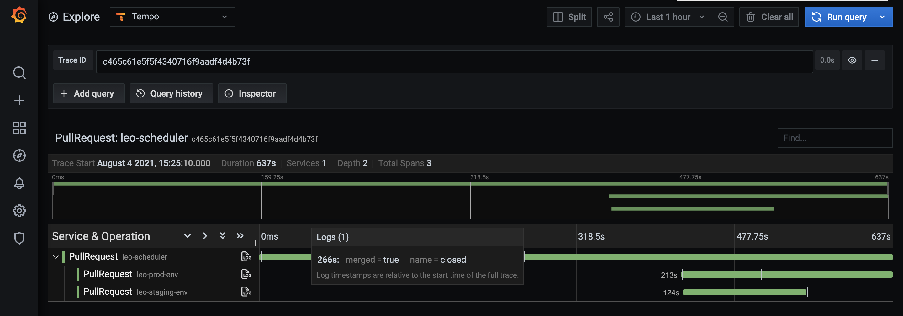

# Lighthouse Telemetry Plugin

This is a [Lighthouse](https://github.com/jenkins-x/lighthouse) (external) plugin, used to generate telemetry data, such as distributed traces.

Here is an example of such a **distributed trace**, including:
- the Lighthouse event: usually a GitHub (or gitlab/etc) webhook event for a git push or a pull request comment, at the origin of a new pipeline execution
- 1 or more LighthouseJob: 1 for each triggered pipeline. In this case we can see a unit-tests pipeline and an integration-tests pipeline
- for each Lighthouse job: the corresponding Tekton PipelineRun and its TaskRuns
- for each TaskRun: the corresponding Pod, with every event: scheduling, pulling/creating/staring containers, etc
- and the Jenkins X Pipeline Activity, with the timing for each step

Another example, for a "**gitops trace**" - which shows the promotion workflow that spans through multiple pull requests:
- a (root) "application" pull request, in the `leo-scheduler` application/repository
- 2 (child) "environment" pull requests, in the `leo-staging-env` and `leo-prod-env` repositories. These PRs have been created by the release pipeline of the `leo-scheduler` application, and are the result of "promoting" the new release, using a gitops workflow.

Video demo: 
https://github.com/jenkins-x/lighthouse-telemetry-plugin/raw/main/docs/screenshots/gitops-trace-tempo.mp4

## Why?

Get insights into what is happening inside Jenkins X in reaction to a git event. Most of the time you won't need it, except when you need it ;-) for example to understand the bottleneck in your pipelines, what is taking time - maybe you're always pulling big images for example.

It's also great for newcomers to understand the workflow, the different parts involved, and so on.

## How?

This application should be registered in your Lighthouse config as an external plugin, so that it can receive http requests for each git webhook event.

Then, for each received event, it will start a new opentelemetry trace.

In the background, it will also use the Kubernetes API to watch for:
- lighthouse jobs
- tekton pipelineruns and TaskRuns
- jenkins x pipeline Activities
- pods
- events

when it will see a new lighthouse job, it will uses the event GUID (stored in an annotation) to retrieve internally the opentelemetry trace (the root span). It will use it to start a new child span for the job, and it will store the span context in an annotation of the job.

when it will see a new tekton pipelinerun, it will retrieve its "parent" lighthouse job (using matching labels), and then extract the parent span context from the annotation of the job - and use it to start a new child span for the pipelinerun.

and so on for the taskrun, and then its child pod. The "trick" here is to propagate the span context in an annotation of the resources - the same way you will do with an HTTP header in a "classic" microservices architecture based on synchronous requests.

and then when each resource (job, pipelinerun, pod, ...) will finish, its associated span will be ended - and pushed by the exporter to whatever backend has been configured (grafana tempo by default in Jenkins X).

TODO: make a diagram...

**Note**: thanks to [kspan](https://github.com/weaveworks-experiments/kspan) for the idea ;-)

### Gitops trace

For the gitops traces, we build a tree of the pull requests, linking them together based on the PR's body/description. We expect the body of an "environment" PR (= a PR that is the result of a release pipeline) to contain the release notes of the application release to promote. Each application PR that is part of the release is linked in the release notes. We use these links to retrieve the "parent" pull requests.

Once a PR has been merged, we wait for a configurable delay to see if a child PR has been created. This allow us to keep the parent span alive until all child PRs have been merged.

Note that for the moment this feature is still beta, it has the following limitations:
- only works for github - because we need provider-specific code to parse the links from the PR body.
- you'll have to read the logs to find the trace ID. We plan to add a link to the trace in a PR comment.
